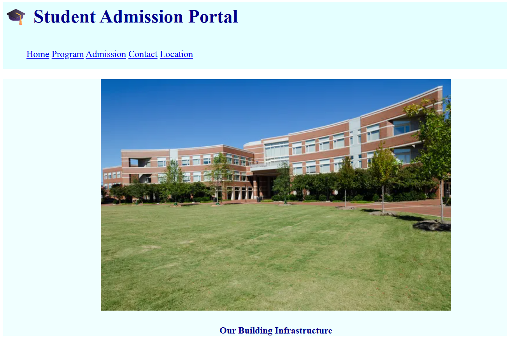
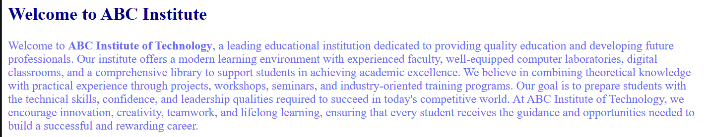
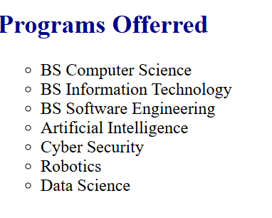
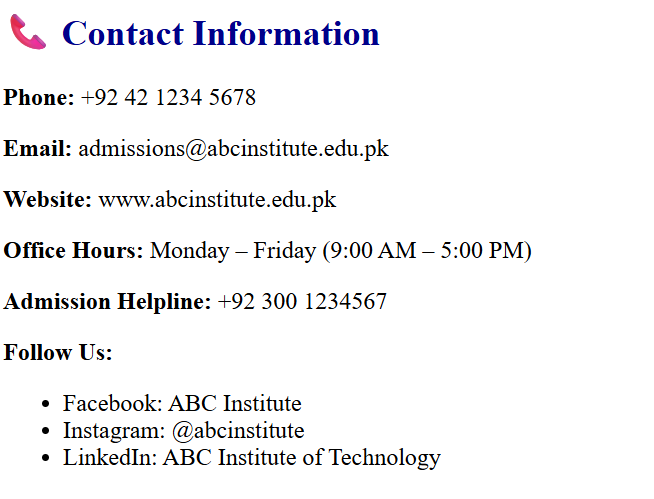

# 🎓 Student Admission Portal

A beginner-friendly **Student Admission Portal** built using **HTML5** and **Inline CSS** as part of my Web Development learning journey. This project demonstrates the fundamentals of creating a simple educational website with multiple sections, an admission form, tables, images, and navigation.

---

## 📖 Project Overview

The Student Admission Portal is a static website designed to simulate a college admission portal. It provides information about the institute, available academic programs, fee structure, and allows students to fill out a basic admission form.

This project was developed to strengthen my understanding of HTML structure, semantic elements, forms, tables, hyperlinks, and basic page styling.

---

## ✨ Features

- 🏠 Home Section
- 🏫 Institute Introduction
- 🎓 Programs Offered
- 💰 Fee Structure Table
- 📝 Student Admission Form
- 📞 Contact Information
- 📍 Google Maps Location Link
- 🖼 Campus Image
- 🧭 Navigation Bar
- 📄 Responsive page layout using HTML and Inline CSS

---

## 🛠 Technologies Used

- HTML5
- Inline CSS

---

## 📚 Concepts Practiced

- Semantic HTML
- Navigation Bar
- Hyperlinks
- Images
- Lists
- Tables
- Forms
- Buttons
- Fieldsets
- Sections
- Basic Page Layout

---

# 📸 Project Screenshots

## 🏠 Home Page



---

## ℹ️ About Institute



---

## 🎓 Programs Offered



---

## 💰 Fee Structure

![Fee]ScreenShots/fee.png)

---

## 📞 Contact Information



---

## 📂 Project Structure

```
Student-Admission-Portal/
│
├── Dashboard.html
├── campus.png
├── README.md
├── home.png
├── nav.png
├── about.png
├── programs.png
├── fee.png
└── contact.png
```

---

## 🚀 Future Improvements

- Convert Inline CSS into External CSS
- Improve Responsive Design
- Add JavaScript Form Validation
- Connect the Admission Form to a Backend Database
- Improve UI/UX
- Add Student Login System
- Add Online Admission Status Tracking

---

## 🎯 Learning Outcomes

Through this project, I practiced:

- Structuring web pages using HTML5
- Creating navigation menus
- Working with forms and input fields
- Designing tables
- Embedding images
- Creating multiple webpage sections
- Organizing a frontend project

---

## 👩‍💻 Author

**Shaiza Shabbir**

Computer Science Student | Web Development Learner

---

### ⭐ Thank you for visiting this repository!

If you found this project helpful, feel free to star the repository.
